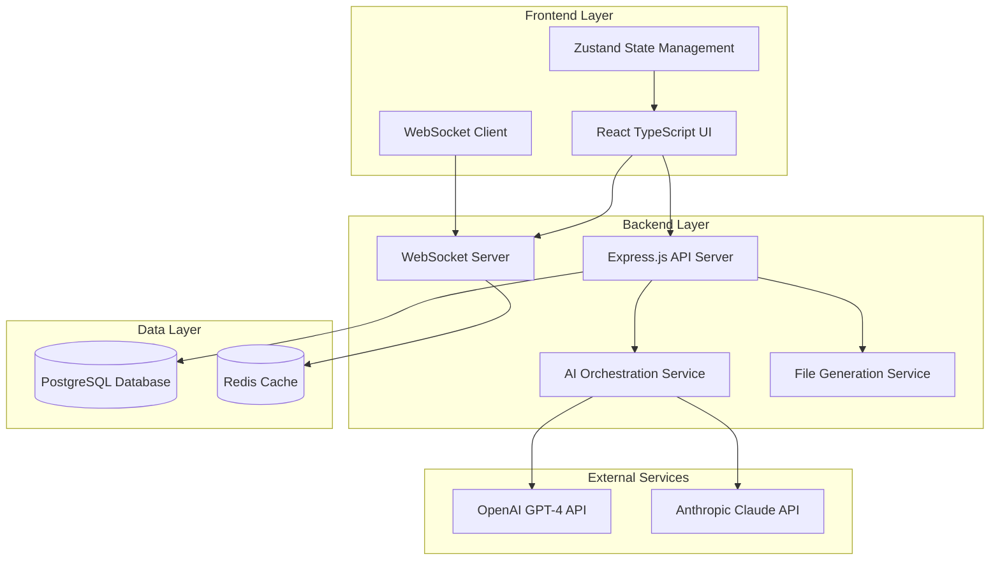

# Design Document

## Overview

SpecForge is architected as a modern full-stack web application with a React TypeScript frontend and Node.js backend. The system simulates an Agile team conversation through AI personas to generate software specifications. The architecture emphasizes real-time communication, scalable AI integration, and reliable file generation capabilities.

## Architecture

### High-Level Architecture



### System Components

- **Frontend**: Single-page React application with TypeScript
- **Backend API**: RESTful Express.js server handling HTTP requests
- **WebSocket Server**: Real-time communication for chat interface
- **AI Orchestration**: Manages multiple AI personas and conversation flow
- **File Generation**: Creates and formats markdown specification files
- **Database**: PostgreSQL with Prisma ORM for type-safe data access
- **Cache**: Redis for session management and real-time data

## Components and Interfaces

### Frontend Components

#### Core Chat Components

```typescript
interface ChatMessage {
  id: string
  conversationId: string
  persona: AIPersona
  content: string
  timestamp: Date
  type: "user" | "ai"
  isTyping?: boolean
}

interface AIPersona {
  id: string
  name: string
  role:
    | "product-manager"
    | "tech-lead"
    | "ux-designer"
    | "devops"
    | "scrum-master"
  avatar: string
  color: string
  expertise: string[]
}
```

#### State Management Structure

```typescript
interface AppState {
  conversation: {
    current: Conversation | null
    messages: ChatMessage[]
    activePersonas: AIPersona[]
    isGenerating: boolean
  }
  specifications: {
    requirements: string | null
    design: string | null
    tasks: string | null
    isPreviewMode: boolean
  }
  ui: {
    isTyping: boolean
    currentTypingPersona: string | null
    sidebarOpen: boolean
  }
}
```

### Backend API Endpoints

#### Conversation Management

- `POST /api/conversations` - Create new conversation
- `GET /api/conversations/:id` - Retrieve conversation
- `POST /api/conversations/:id/messages` - Add message to conversation
- `GET /api/conversations/:id/messages` - Get conversation messages

#### AI Integration

- `POST /api/ai/generate-response` - Generate AI persona response
- `POST /api/ai/orchestrate-conversation` - Manage multi-persona interaction
- `GET /api/ai/personas` - Get available AI personas

#### Specification Generation

- `POST /api/specifications/generate` - Generate all specification files
- `GET /api/specifications/:conversationId` - Retrieve generated specs
- `GET /api/specifications/:conversationId/download` - Download specs as ZIP

### WebSocket Events

#### Client to Server

```typescript
interface ClientEvents {
  "join-conversation": { conversationId: string }
  "send-message": { conversationId: string; message: string }
  "request-ai-response": {
    conversationId: string
    context: ConversationContext
  }
}
```

#### Server to Client

```typescript
interface ServerEvents {
  "message-received": ChatMessage
  "ai-typing-start": { persona: AIPersona }
  "ai-typing-end": { persona: AIPersona }
  "ai-response": ChatMessage
  "conversation-updated": Conversation
  "specifications-ready": { conversationId: string }
}
```

## Data Models

### Database Schema with Prisma

#### Conversations Table

```sql
CREATE TABLE conversations (
  id UUID PRIMARY KEY DEFAULT gen_random_uuid(),
  user_id UUID, -- Optional for anonymous users
  title VARCHAR(255) NOT NULL,
  description TEXT,
  status VARCHAR(20) CHECK (status IN ('active', 'completed', 'archived')) DEFAULT 'active',
  app_idea TEXT NOT NULL,
  target_users TEXT[], -- Array of target user types
  complexity VARCHAR(20) CHECK (complexity IN ('simple', 'moderate', 'complex')),
  created_at TIMESTAMP WITH TIME ZONE DEFAULT NOW(),
  updated_at TIMESTAMP WITH TIME ZONE DEFAULT NOW()
);
```

```typescript
interface ConversationRow {
  id: string
  userId?: string
  title: string
  description: string
  status: "active" | "completed" | "archived"
  appIdea: string
  targetUsers: string[]
  complexity: "simple" | "moderate" | "complex"
  createdAt: Date
  updatedAt: Date
}
```

#### Messages Table

```sql
CREATE TABLE messages (
  id UUID PRIMARY KEY DEFAULT gen_random_uuid(),
  conversation_id UUID NOT NULL REFERENCES conversations(id) ON DELETE CASCADE,
  persona_id VARCHAR(50), -- null for user messages
  persona_name VARCHAR(100),
  persona_role VARCHAR(50),
  content TEXT NOT NULL,
  message_type VARCHAR(10) CHECK (message_type IN ('user', 'ai')) NOT NULL,
  tokens INTEGER,
  processing_time_ms INTEGER,
  context JSONB,
  created_at TIMESTAMP WITH TIME ZONE DEFAULT NOW()
);
```

```typescript
interface MessageRow {
  id: string
  conversationId: string
  personaId?: string
  personaName?: string
  personaRole?: string
  content: string
  messageType: "user" | "ai"
  tokens?: number
  processingTimeMs?: number
  context?: any
  createdAt: Date
}
```

#### Specifications Table

```sql
CREATE TABLE specifications (
  id UUID PRIMARY KEY DEFAULT gen_random_uuid(),
  conversation_id UUID NOT NULL REFERENCES conversations(id) ON DELETE CASCADE,
  requirements TEXT NOT NULL,
  design TEXT NOT NULL,
  tasks TEXT NOT NULL,
  version INTEGER DEFAULT 1,
  total_tokens INTEGER,
  generation_time_ms INTEGER,
  file_size_bytes INTEGER,
  generated_at TIMESTAMP WITH TIME ZONE DEFAULT NOW()
);
```

```typescript
interface SpecificationRow {
  id: string
  conversationId: string
  requirements: string
  design: string
  tasks: string
  version: number
  totalTokens: number
  generationTimeMs: number
  fileSizeBytes: number
  generatedAt: Date
}
```

#### Prisma Schema Definition

```prisma
// schema.prisma
generator client {
  provider = "prisma-client-js"
}

datasource db {
  provider = "postgresql"
  url      = env("DATABASE_URL")
}

model Conversation {
  id          String   @id @default(cuid())
  userId      String?  // Optional for anonymous users
  title       String
  description String?
  status      ConversationStatus @default(ACTIVE)
  appIdea     String
  targetUsers String[]
  complexity  Complexity?
  createdAt   DateTime @default(now())
  updatedAt   DateTime @updatedAt

  messages      Message[]
  specifications Specification[]

  @@map("conversations")
}

model Message {
  id               String      @id @default(cuid())
  conversationId   String
  personaId        String?     // null for user messages
  personaName      String?
  personaRole      PersonaRole?
  content          String
  messageType      MessageType
  tokens           Int?
  processingTimeMs Int?
  context          Json?
  createdAt        DateTime    @default(now())

  conversation Conversation @relation(fields: [conversationId], references: [id], onDelete: Cascade)

  @@map("messages")
}

model Specification {
  id               String   @id @default(cuid())
  conversationId   String
  requirements     String
  design           String
  tasks            String
  version          Int      @default(1)
  totalTokens      Int?
  generationTimeMs Int?
  fileSizeBytes    Int?
  generatedAt      DateTime @default(now())

  conversation Conversation @relation(fields: [conversationId], references: [id], onDelete: Cascade)

  @@map("specifications")
}

enum ConversationStatus {
  ACTIVE
  COMPLETED
  ARCHIVED
}

enum Complexity {
  SIMPLE
  MODERATE
  COMPLEX
}

enum MessageType {
  USER
  AI
}

enum PersonaRole {
  PRODUCT_MANAGER
  TECH_LEAD
  UX_DESIGNER
  DEVOPS
  SCRUM_MASTER
}
```

#### Database Service with Prisma

```typescript
import {
  PrismaClient,
  Conversation,
  Message,
  Specification,
} from "@prisma/client"

class DatabaseService {
  private prisma: PrismaClient

  constructor() {
    this.prisma = new PrismaClient()
  }

  async createConversation(data: {
    userId?: string
    title: string
    description?: string
    appIdea: string
    targetUsers: string[]
    complexity?: "SIMPLE" | "MODERATE" | "COMPLEX"
  }) {
    return this.prisma.conversation.create({
      data,
      include: {
        messages: true,
        specifications: true,
      },
    })
  }

  async getConversation(id: string) {
    return this.prisma.conversation.findUnique({
      where: { id },
      include: {
        messages: { orderBy: { createdAt: "asc" } },
        specifications: { orderBy: { version: "desc" }, take: 1 },
      },
    })
  }

  async addMessage(data: {
    conversationId: string
    personaId?: string
    personaName?: string
    personaRole?:
      | "PRODUCT_MANAGER"
      | "TECH_LEAD"
      | "UX_DESIGNER"
      | "DEVOPS"
      | "SCRUM_MASTER"
    content: string
    messageType: "USER" | "AI"
    tokens?: number
    processingTimeMs?: number
    context?: any
  }) {
    return this.prisma.message.create({ data })
  }

  async createSpecification(data: {
    conversationId: string
    requirements: string
    design: string
    tasks: string
    totalTokens?: number
    generationTimeMs?: number
    fileSizeBytes?: number
  }) {
    return this.prisma.specification.create({ data })
  }
}
```

### AI Persona Configuration

```typescript
interface PersonaConfig {
  systemPrompt: string
  conversationStarters: string[]
  questionTemplates: string[]
  responseStyle: {
    tone: string
    expertise: string[]
    focusAreas: string[]
  }
  collaborationRules: {
    whenToEngage: string[]
    conflictResolution: string[]
    handoffTriggers: string[]
  }
}
```

## Error Handling

### Frontend Error Boundaries

- React Error Boundaries for component-level error handling
- Global error handler for unhandled promise rejections
- User-friendly error messages with retry mechanisms
- Offline detection and graceful degradation

### Backend Error Handling

- Centralized error middleware for Express.js
- Structured error responses with consistent format
- AI API failure fallbacks and retry logic
- Rate limiting with exponential backoff
- Database connection error recovery

### Error Response Format

```typescript
interface ErrorResponse {
  error: {
    code: string
    message: string
    details?: any
    timestamp: Date
    requestId: string
  }
  success: false
}
```

## Testing Strategy

### Frontend Testing

- **Unit Tests**: Jest + React Testing Library for components
- **Integration Tests**: Testing user flows and state management
- **E2E Tests**: Playwright for complete user journeys
- **Visual Regression**: Chromatic for UI consistency
- **Accessibility**: axe-core for WCAG compliance

### Backend Testing

- **Unit Tests**: Jest for individual functions and services
- **Integration Tests**: Supertest for API endpoint testing
- **AI Integration Tests**: Mock AI responses for consistent testing
- **Load Tests**: Artillery for performance under concurrent load
- **Database Tests**: In-memory MongoDB for isolated testing

### Test Coverage Goals

- Frontend: 85% code coverage minimum
- Backend: 90% code coverage minimum
- Critical paths: 100% coverage (auth, file generation, AI integration)

### Testing Environments

- **Development**: Local testing with mocked AI responses
- **Staging**: Full integration testing with rate-limited AI APIs
- **Production**: Monitoring and alerting for real-time issue detection

## Security Considerations

### API Security

- Rate limiting per IP and user session
- Input validation and sanitization
- CORS configuration for allowed origins
- API key rotation and secure storage
- Request/response logging for audit trails

### Data Protection

- No storage of sensitive user data
- Conversation data encryption at rest
- Secure session management with Redis
- GDPR compliance for data deletion requests
- Regular security audits and penetration testing

### AI Integration Security

- API key management through environment variables
- Request/response filtering for sensitive content
- Token usage monitoring and alerting
- Fallback mechanisms for AI service outages
- Content moderation for generated specifications

## Performance Optimization

### Frontend Performance

- Code splitting and lazy loading for route-based chunks
- React.memo and useMemo for expensive computations
- Virtual scrolling for long conversation histories
- Image optimization and lazy loading
- Service worker for offline functionality

### Backend Performance

- Connection pooling for database operations
- Redis caching for frequently accessed data
- Response compression and CDN integration
- Async/await patterns for non-blocking operations
- Database indexing for query optimization

### AI Integration Optimization

- Request batching for multiple persona responses
- Response caching for similar conversation patterns
- Streaming responses for real-time user feedback
- Token usage optimization and monitoring
- Fallback to cached responses during high load

## Deployment Architecture

### AWS Infrastructure

- **Frontend**: CloudFront + S3 for static asset delivery
- **Backend**: ECS Fargate for containerized API deployment
- **Database**: MongoDB Atlas for managed database service
- **Cache**: ElastiCache Redis for session management
- **Load Balancer**: Application Load Balancer for high availability
- **Monitoring**: CloudWatch for logs and metrics

### CI/CD Pipeline

- **Source Control**: GitHub with branch protection rules
- **Build**: GitHub Actions for automated testing and building
- **Deployment**: Automated deployment to staging and production
- **Rollback**: Blue-green deployment strategy for zero-downtime updates
- **Monitoring**: Real-time alerts for deployment issues

### Environment Configuration

- **Development**: Local development with Docker Compose
- **Staging**: Full AWS stack with limited AI API quotas
- **Production**: Auto-scaling groups with health checks
- **Disaster Recovery**: Multi-AZ deployment with automated backups
